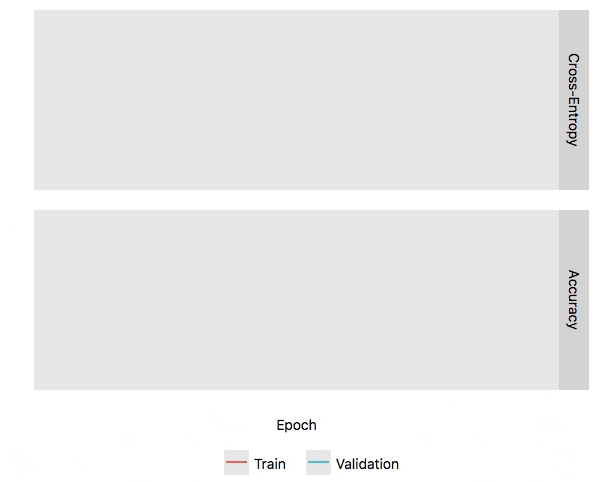

# lrcurve

**Creates a learning-curve plot for Jupyter/Colab notebooks that is
updated in real-time.**

There is a framework agnostic interface `lrcurve.PlotLearningCurve`
that works well with PyTorch and Tensorflow and a keras wrapper
`lrcurve.KerasLearningCurve` that uses the keras callback interface.

`lrcurve` works with python 3.6 or newer and is distributed under the
MIT license.


## Install

```bash
pip install -U lrcurve
```

## API

* [`lrcurve.PlotLearningCurve`](lrcurve/plot_learning_curve.py)
* [`lrcurve.KerasLearningCurve`](lrcurve/keras_learning_curve.py)

## Examples

* [Keras example](#keras-example)
* [Framework agnostic example](#framework-agnostic-example)
* [PyTorch example](#pytorch-example)

### Keras example
[](https://colab.research.google.com/github/AndreasMadsen/python-lrcurve/blob/master/notebooks/keras_example.ipynb)

```python
from lrcurve import KerasLearningCurve

model.compile(optimizer=keras.optimizers.Adam(),
              loss=keras.losses.SparseCategoricalCrossentropy(from_logits=True),
              metrics=[keras.metrics.SparseCategoricalAccuracy()])

model.fit(train.x, train.y,
          epochs=100,
          verbose=0,
          validation_data=(validation.x, validation.y),
          callbacks=[KerasLearningCurve()])
```


### Framework agnostic example
[](https://colab.research.google.com/github/AndreasMadsen/python-lrcurve/blob/master/notebooks/emulated_training.ipynb)

```python
with PlotLearningCurve() as plot:
    for i in range(100):
        plot.append(i, {
            'loss': {
                'train': math.exp(-(i+1)/10),
                'validation': math.exp(-i/10)
            }
        })
        plot.draw()
        time.sleep(0.1)
```


### PyTorch example
[](https://colab.research.google.com/github/AndreasMadsen/python-lrcurve/blob/master/notebooks/pytorch_example.ipynb)

```python
from lrcurve import PlotLearningCurve

plot = PlotLearningCurve(
    facet_config = {
        'loss': { 'name': 'Cross-Entropy', 'limit': [0, None] },
        'accuracy': { 'name': 'Accuracy', 'limit': [0, 1] }
    },
    xaxis_config = { 'name': 'Epoch', 'limit': [0, 500] }
)

with plot:
    # optimize model
    for epoch in range(500):
        # compute loss
        z_test = network(x_test)
        loss_test = criterion(z_test, y_test)

        optimizer.zero_grad()
        z_train = network(x_train)
        loss_train = criterion(z_train, y_train)
        loss_train.backward()
        optimizer.step()

        # compute accuacy
        accuacy_test = sklearn.metrics.accuracy_score(torch.argmax(z_test, 1).numpy(), y_test)
        accuacy_train = sklearn.metrics.accuracy_score(torch.argmax(z_train, 1).numpy(), y_train)

        # append and update
        plot.append(epoch, {
            'loss': {
                'train': loss_train,
                'validation': loss_test
            },
            'accuracy': {
                'train': accuacy_train,
                'validation': accuacy_test
            }
        })
        plot.draw()
```



## Sponsor

Sponsored by <a href="https://www.nearform.com/research/">NearForm Research</a>.
